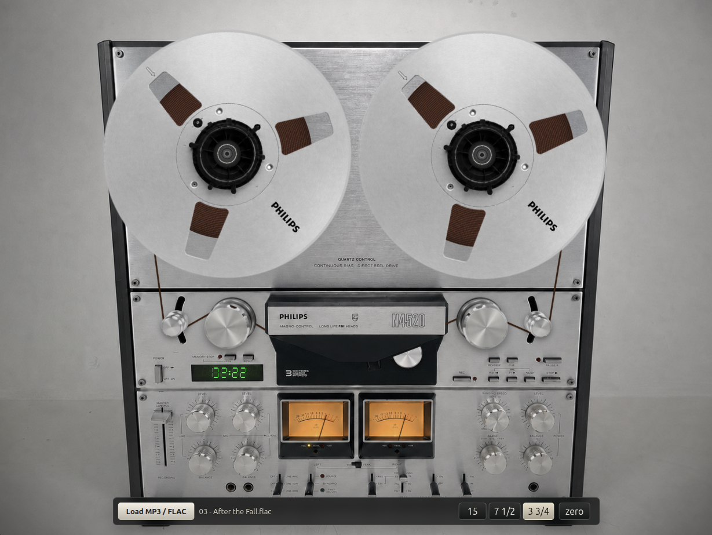

# Philips N4520 Home Assistant Card

A HACS-installable Home Assistant dashboard card that renders a Philips N4520 reel-to-reel styled media player for any Home Assistant `media_player` entity.



<video src="assets/demo.mp4" controls muted playsinline></video>

Demo video: [assets/demo.mp4](assets/demo.mp4).

The card uses a photo-composited N4520 transport with rotating reels, tape packs, rollers, VU needles, status LEDs, a counter, transport controls, and a reel sticker for track metadata. The distributable HACS artifact lives in `dist/philips-n4520-player.js`, with required image assets in `dist/assets/`.

## Install With HACS

Until this repository is published as a default HACS repository, add it as a custom repository:

1. Open HACS.
2. Use the three-dot menu and choose Custom repositories.
3. Add this repository URL.
4. Set the category to Dashboard.
5. Install `Philips N4520 Player`.

Add the card to a dashboard:

```yaml
type: custom:philips-n4520-player
entity: media_player.your_player
name: Listening room
```

The card reads normal Home Assistant media player state for playback status, metadata, duration, progress, and transport actions.

## Card Configuration

Required:

- `entity`: Home Assistant `media_player` entity.

Optional:

- `name`: display name shown by the card.
- `left_level_entity` / `right_level_entity`: development-only dB/level sensors for real meter input.
- `fake_vu`: enables the visual fallback VU motion when no live level source is configured.
- `sendspin_enabled` and related Sendspin options: optional decoded PCM level source for setups that expose a compatible Sendspin endpoint.

Detailed card configuration notes are in `integration-support/home-assistant-card/README.md`.

## Repository Shape

- `dist/philips-n4520-player.js`: HACS dashboard plugin artifact.
- `dist/assets/`: image assets loaded by the HACS card.
- `dist/vendor/sendspin-js/`: vendored runtime used by the optional Sendspin VU source.
- `integration-support/home-assistant-card/src/philips-n4520-player.js`: editable card source. Keep this identical to the `dist/` artifact unless a build step is added.
- `hacs.json`: HACS metadata.
- `standalone/`: preserved local-file browser prototype with its own run instructions.
- `assets/`: source/reference assets shared by the standalone prototype and documentation.

## Development

Install dependencies once:

```bash
npm install
```

Check JavaScript syntax:

```bash
npm run check
```

Verify the source card and HACS artifact match:

```bash
cmp -s integration-support/home-assistant-card/src/philips-n4520-player.js dist/philips-n4520-player.js
```

The Playwright smoke test still exercises the preserved standalone browser demo. Start a static server from the repository root:

```bash
python3 -m http.server 4173
```

Then run:

```bash
npm test
```

The test writes `test-results/n4520-render.png` for visual inspection.
